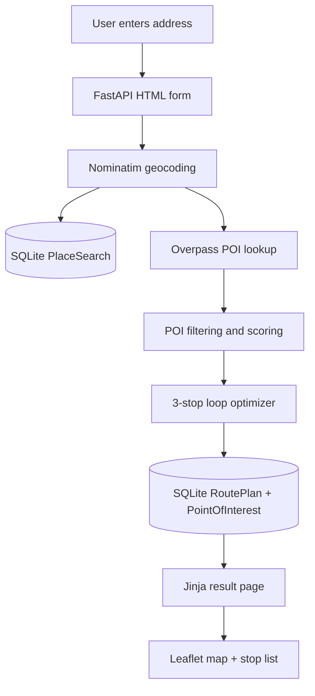

# Pocket Trails

Pocket Trails is a tiny FastAPI web app that turns a pasted neighborhood address into a one-page walking loop with 3 nearby points of interest, ranked and optimized into the shortest route.

The MVP uses live OpenStreetMap data:

- **Nominatim** for address geocoding
- **Overpass API** for nearby points of interest
- A simple brute-force path ranking algorithm over 3 stops to pick the shortest walking loop
- **Leaflet** for the map view
- **SQLite** for saving generated searches and plans

## Architecture



## Requirements

- Python 3.11+
- Internet access for live OpenStreetMap/Nominatim/Overpass data

No API key is required.

## Run locally

```bash
cd brain-pocket-trails
python -m venv .venv
source .venv/bin/activate  # Windows: .venv\Scripts\activate
pip install -r requirements.txt
cp .env.example .env
uvicorn app.main:app --reload
```

Open:

```text
http://127.0.0.1:8000
```

Try addresses like:

- `Washington Square Park, New York, NY`
- `Pike Place Market, Seattle, WA`
- `Covent Garden, London`
- `Mission Dolores Park, San Francisco, CA`

## One-command Docker option

If you prefer Docker:

```bash
docker compose up --build
```

Then open `http://127.0.0.1:8000`.

## Environment variables

See `.env.example`.

| Variable | Default | Description |
| --- | --- | --- |
| `APP_NAME` | `Pocket Trails` | Display/application name |
| `DATABASE_URL` | `sqlite:///./pocket_trails.db` | SQLite database URL |
| `NOMINATIM_BASE_URL` | `https://nominatim.openstreetmap.org` | Geocoding API base URL |
| `OVERPASS_URL` | `https://overpass-api.de/api/interpreter` | Overpass API endpoint |
| `USER_AGENT` | `PocketTrailsMVP/1.0` | Required polite user agent for OSM services |
| `SEARCH_RADIUS_M` | `900` | Radius around the start point for POI search |

## Notes

- This is an MVP and uses straight-line haversine distances for ranking. It displays a clear loop and approximate distances, but does not perform turn-by-turn routing.
- If Overpass returns too few POIs or is temporarily unavailable, the app creates sensible fallback stops around the start point so the end-to-end demo still works.
- Please respect OpenStreetMap/Nominatim usage policies for production use.
